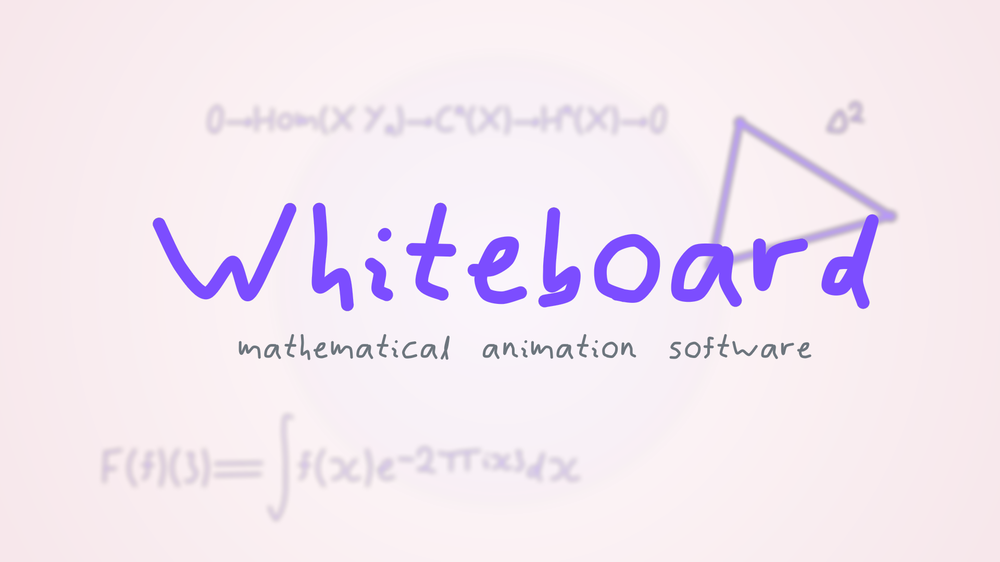

# Whiteboard



Whiteboard is a text-driven animation tool for producing hand-drawn mathematical explanation videos.

This project exists because making the original [Boarbarktree](https://www.youtube.com/@boarbarktree) videos by hand was an outrageous amount of work, and I could not sustain it. I managed three videos in Adobe Animate through sheer stubbornness, then stopped because the process demanded more time and energy than I could keep giving it.

The obvious next idea was to automate the workflow. I wanted something in the general direction of Grant Sanderson's animation tooling, but I am far too opinionated about style and workflow to simply adopt his stack directly, so I started writing my own system instead.

That also turned out to be a great deal of work, and the project stalled before it got very far.

I came back to it because I still wanted to make the videos. Coding agents made it practical to build the tool I needed instead of choosing between an unsustainable manual workflow and abandoning the project. They are a useful part of the process: contemporary technology put to work in service of a personal artistic and mathematical vision, not the subject of the work.

The result is deliberately opinionated: it is meant for math-heavy explanation videos, not generic motion graphics. The focus is on clarity, whiteboard-style linework, and a spec format that stays close to the way these videos are actually built.

Example specs live in `examples/`, including a smoke test, a topology sketch, a title-card demo, and several patch-focused showcases such as `patch_showcase.md`, `advanced_patch_showcase.md`, and `patch_group_target_showcase.md`.

Patch-specific notes and current semantics live in [docs/patch_reference.md](/mbnim/docs/patch_reference.md:1).

For quick visual inspection without encoding a full video, render a still snapshot:

```text
./Whiteboard examples/title_card.md --snapshot
./Whiteboard examples/title_card.md --snapshot snaps/title.ppm --snapshot-time 0.14
./Whiteboard examples/transition_smoke.md --snapshot --snapshot-video-time 0.90
```

This writes a binary PPM image of the chosen frame. `--snapshot-time` is relative to one scene; `--snapshot-video-time` is relative to the final stitched video timeline, so it can capture crossfades and overlaps. If no path is given, Whiteboard derives one from the video output name.

## What this is

Whiteboard is intended to be a text-driven animation tool for long-form mathematical explanation videos.

The desired workflow is:

```text
write video spec
render video
adjust spec
render again
publish
```

The spec should eventually describe scenes, timing, text, math notation, planar diagrams, 3D diagrams, layers, backgrounds, movement, jitter, blur, glow, fades, and other whiteboard-ish effects.

The target use case is maths-heavy video, including things like algebraic topology, where the author needs notation, diagrams, spaces, maps, arrows, quotient-y things, deformations, surfaces, and explanatory motion quickly.

## How it is being built

Whiteboard is being built to make mathematical videos practical to author again.

It is not intended as a generic motion-graphics platform or a tutorial exercise in compilers, graphics, rendering, C, parsing, or animation systems. Those disciplines matter here because the tool depends on them, and the implementation should be clear, maintainable, and tested where it matters.

Coding agents are part of the workflow because they make this work more feasible. Their use does not change the standard: work in the repository should have a purpose, fit the architecture, preserve the visual language, and be verified in proportion to its risk.

The durable design constraints for the project are collected in [Guiding Principles](design/guiding_principles.md).

## Visual target

The engine should preserve the handmade whiteboard feel of the original videos as much as possible.

Important ingredients:

- near-white radial-gradient backgrounds
- hand-drawn-looking linework
- constant visible stroke thickness
- notation that looks like the author's actual handwriting
- subtle jitter/redraw behaviour
- smooth object and camera motion
- diagram-first mathematical clarity
- no sudden visual-language changes from fallback fonts or mismatched symbols

The intended result is not “clean corporate explainer animation”. It should look like mathematical scratchwork that has been gently possessed by a rendering engine.

## Handwritten symbol pipeline

The project uses a small HTML-based capture workflow to record tablet strokes and turn them into reusable symbols.

This is important: captured/processed handwritten symbols are the source of truth for the visual language. The engine should avoid falling back to generic fonts or symbol sets in ways that break the handmade look.

Over time, the math/text system should support LaTeX-ish notation while still rendering symbols in the captured handwritten style.

## Spec language

The exact spec language is still evolving.

Possible directions include:

- a bespoke DSL tailored to animation and mathematics
- Markdown with fenced scene blocks
- YAML/TOML plus embedded expressions
- Lua as a scripting layer

The important thing is that the author can write mathematical animation naturally, with breathing room, and without having to spell out every default.

Math strings are parsed directly. Use `"$\alpha+\beta$"`, not doubled backslashes.

2D scenes now have an implicit centred mathematical root patch.  By default its visible world is `y = [-1,1]` and `x = [-aspect,aspect]`, so `(0,0)` is the centre and one world unit has equal scale on both rendered axes.  Positions and visual sizes are written in world units: changing output aspect ratio reveals more or less horizontal world rather than stretching the diagram.  The root is scene-owned and intentionally configurable by future language primitives, but ordinary scenes never need to mention it.

Structured blocks can also carry scoped defaults. `defaults:` blocks support properties like `colour`, `thickness`, `opacity`, and `jitter`, and they now nest by indentation so inner groups can temporarily override outer styling and then fall back cleanly when that inner scope ends.

There is also now a first pass at `patch:` blocks for local coordinate authoring. In 2D, a patch can translate, scale, rotate, and optionally reinterpret local `(r,theta)` pairs as polar coordinates before flattening its contents back into the current layer. In 3D, the path is still a modest parser-plus-render-time layer rather than a full scene graph, but patches can already translate, scale, and orient nested 3D primitives before they hit the existing renderer, and can now reinterpret local tuples as cartesian, cylindrical, or spherical coordinates before that flattening step.

That patch pass now also has first local animation helpers: `move_patch`, `turn_patch`, and `scale_patch`. `move_patch` works for both 2D and first-pass 3D patches by compiling to render-time per-object translations for the patch's current members, and nested parent/child patch translations now compose additively instead of clobbering each other. `turn_patch` and `scale_patch` still drive the 2D affine path, and now also have a first 3D form that applies Euler-style `(yaw,pitch,roll)` rotation plus scalar or `(sx,sy,sz)` scaling around the patch origin before projection; the old scalar `turn_patch` form still means yaw-only rotation for compatibility. Nested parent/child patch transforms now compose in render order instead of only the last one winning. Polygonal, blob-like, curve, and math-stroke 2D primitives now also follow that same patch affine path rather than partially bypassing it, and grouped/generated 3D convenience objects such as `tetra3d`, `cube3d`, and `axes3d` animate correctly inside patches because their generated members stay attached to the patch’s group bookkeeping. Named patches also participate in the same group-targeting path as other grouped objects, so generic `draw`, `fade`, and world-space `move` commands can target a patch name directly in addition to the patch-local helpers, and grouped targets can now also take explicit-pivot world-space `turn name around (...)` and `scale name around (...)` transforms. Inline and structured-block forms both work for these helpers. It is still not a full animated patch scene graph, but it is enough to make nested diagrams feel much more usable.

Every scene also starts with an implicit default layer, so ordinary single-layer specs do not need to say `layer:` at all. Scenes also default to the standard near-white radial gradient, so you only need `background:` when you want to restate or customize it. Explicit layers are still useful when you want ordering, blur, opacity, camera separation, or named layer actions.

A rough target should feel more like this:

```text
video:
  output "quotient_space.mp4"

scene "quotient space intuition":
  45s

  defaults:
    colour blue

  math title "$X / \sim$":
    (0.20w, 0.15h)
    size 72

  circ shell:
    (0.50w, 0.52h)
    radius 0.13m

  pt p:
    (0.62w, 0.52h)

  opt q:
    (0.38w, 0.52h)

scene "fibre picture":
  18s

  camera:
    distance 6
    center (0.50w, 0.50h)

  tetra3d fibre:
    (0,0,1) (-1,-1,0) (1,-1,0) (0,1,0)
    opacity 0.10
```

Current parser direction includes scenes, implicit or explicit layers, math, text, points, circles, segments, planar curves, freeform blobs, projected 3D wireframe loops, generic shaded 3D faces, sampled 3D surface patches, first-pass `mesh3d` convenience meshes, first-pass `blob3d` implicit-looking surfaces, first-pass `param3d` sampled parametric curves, first-pass `param_surface3d` sampled parametric surfaces, first-pass `volume3d` translucent shell volumes, perspective/orthographic camera blocks, grouped defaults, moves, fades, and transitions in a first pass at this more indented style.

The parser now also has a first local-coordinate path via nested `patch` blocks with `at`, `scale`, `rotate`, and `coords cartesian|polar`. That is not yet a full scene-graph rewrite or a layer replacement; it is a practical first pass that composes nested local transforms and then hands ordinary flattened objects to the existing renderer.

There is also now a real handwritten `text` object for ordinary labels/subtitles, so specs no longer have to abuse the math parser just to place plain words.

Layers can now also carry a first-pass `glow` effect, which renders a blurred bloom copy behind the layer before compositing the sharp original.

3D camera blocks now also support `look_at (x,y,z)` / `target (x,y,z)` as a first real world-space aim point. That lets a layer orbit or project around something other than the implicit origin without pretending the camera system is fully finished.

`move_camera` can now animate that target too, via `target (x,y,z) -> (x,y,z)` on the camera move command, so tracking shots do not have to snap between static aim points.

Backgrounds also support a first `paper` mode, which keeps the usual radial gradient base but adds a subtle deterministic paper/whiteboard texture overlay instead of a perfectly flat clean field.

## Intended features

Whiteboard should eventually support:

- multiple scenes per video
- scene durations and local timelines
- per-scene backgrounds
- ordered 2D and 3D layers
- layer opacity and movement
- layer-level effects such as Gaussian blur
- ordinary text and LaTeX-ish math text
- handwritten captured symbols
- draw-on animations
- fades
- easing/timing controls
- object movement
- layer movement
- camera movement
- coherent hand-drawn jitter
- planar figures
- projected 3D figures
- shaded regions and surfaces
- long-form video specs

## 2D drawing goals

Convenient 2D primitives should include:

- points
- open points
- line segments
- rays
- arrows
- dotted and dashed lines
- circles
- ellipses
- triangles
- polygons
- blobs/freeform regions
- parametric curves
- shaded planar regions

Simple analytic primitives should eventually be represented as jitterable drawn figures rather than sterile perfect geometry.

## 3D drawing goals

The 3D path is roughly:

1. represent curves and surfaces using NURBS or NURBS-like primitives
2. apply 3D object transforms
3. project through a camera
4. convert projected curves into planar drawn curves where possible
5. render them through the same whiteboard stroke pipeline as 2D figures

Useful 3D primitives should eventually include:

- points
- line segments
- triangles
- tetrahedra
- polygon meshes
- wireframes
- parametric curves
- parametric surfaces
- blob/implicit-looking surfaces
- shaded surfaces or volumes

The key visual constraint is that projected 3D linework should still look like whiteboard linework, not like a different renderer suddenly wandered in.

## Renderer architecture

The likely architecture is:

```text
spec
  -> parser
  -> scene graph
  -> layers
  -> objects
  -> layer buffers
  -> effects
  -> compositing
  -> final frames
```

Layers are rendered to intermediate buffers, effects are applied at the layer level, and layers are composited in order.

This makes blur, glow, opacity, translation, and future effects much easier to reason about.

## Current/near-term status

Some early infrastructure exists, including:

- first minimal spec format
- radial-gradient background support
- offscreen layer buffers and compositing
- layer translation
- CPU-side separable Gaussian blur
- parser work for scenes, layers, math, movement, lines, points, and open points

Near-term priorities:

- replace transparent-black compositing with true alpha-channel layer buffers
- convert primitive line segments and open points to jitterable NURBS-style drawn figures
- add explicit jitter controls for objects and layers
- implement antialiasing consistently
- fix scaling, baselines, descenders, tall operators, and awkward captured symbols
- add first 3D primitives and camera projection
- render projected 3D curves through the existing planar drawing path

## Development philosophy

This project should stay rigorously pragmatic.

A feature is good if it helps make the videos easier to produce.

A clever architecture is good only if it reduces future pain.

A small, well-scoped implementation is preferable to unnecessary abstraction, but shortcuts must not silently create architectural debt or undermine the authoring model.

A perfect system that delays making videos is a failure.

Use the tools that make the work viable, then get on with making the videos. Keep the artistic direction, technical judgment, and finished videos at the centre.
